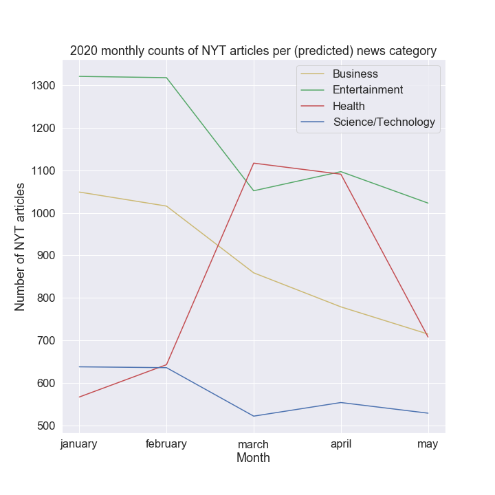

# News Categorizer

**This project is a submission for the 2020**
**Microsoft Student Accelerator Program, AI & Advanced Analytics bootcamp.**

## Table of contents

* [Description](#description)
* [Dataset Sources](#dataset-sources)
* [Training and testing the models](#training-and-testing-the-models)
* [Results](#results)
* [Running on Azure notebooks](#running-on-azure-notebooks)
* [Environment setup and dependencies](#environment-setup-and-dependencies)

## Description

The project idea, choices of models and datasets are summarized in
[`description.pdf`](tex/description.pdf).

The aims of this project were:

* To develop a news headline text classifier.
* To compare 3 machine learning approaches (Naive Bayes, SGD, neural network)
  in medium-sized text classification.
* To roughly estimate what kind of articles the New York Times has been
  publishing in 2020 (expecting a spike in health-related articles due to the
  pandemic).

The classifier models were trained to, given a headline text of any length,
predict what news category it would belong to, out of "business",
"entertainment", "health", and "science/technology".

## Dataset sources

* [News Aggregator Dataset](https://www.kaggle.com/uciml/news-aggregator-dataset):
  Headlines and categories of 400k news stories from 2014,
  derived from the UCI Machine Learning Repository
  [dataset](http://archive.ics.uci.edu/ml/datasets/News+Aggregator).
* Headlines of the New York Times' monthly free to read articles in 2020 that I
  gathered from [their site map](https://spiderbites.nytimes.com/2020/).

## Training and testing the models

* [Running on Azure notebooks](#running-on-azure-notebooks)
  (slower, but no need to replicate environment)
* [Running locally](#environment-setup-and-dependencies)

The training and testing code for the three models used are
in both `news-categorizer.py` and `news-categorizer.ipynb` (the former is
just a conversion of the latter). Running them will both train and test the
models, as well as produce output and visualizations.

The exact preprocessing steps that were taken are documented in the Jupyter
notebook.

## Results

### Outputs

* Bar graph of the composition of the training data.
* Visualizations for the confusion matrices of the Naive Bayes and SGD models
* Plots of the accuracy and loss across epochs for the neural network
* A plot of the 2020 New York Times monthly number of articles grouped by
  category as predicted by the neural network.
* A CSV of all the free to read 2020 articles gathered, with their predicted
  categories.

### Model comparison

A summary of the model comparison, figures taken from a sample run:

| Model                     | Accuracy | Training time | Preprocessing time |
| ------------------------- | -------- | ------------- | ------------------ |
| Naive Bayes               | 92.6%    | 0.1s          | 8.1s               |
| SGD                       | 93.8%    | 3.0s          | 8.1s               |
| Neural network (non-LSTM) | 96.8%    | 91.9s         | 13.3s              |

The loss for the neural network was around 8.8%.

The results are approximate as there are variations between runs due to
randomness.

The neural network was chosen for the following analysis due to its high
accuracy.

### the New York Times analysis

A total of 17235 articles were categorized by the neural network. The
results from the sample run:



Unsurprisingly, we see a very sharp increase in health-related articles
recently. Perhaps as a consequence of that, there were slight declines in the
counts for the other categories. Though, because the 4 categories obviously
do not encompass all of the New York Times' content, these results are not to
be taken too seriously.

## Running on Azure notebooks

The Jupyter notebook is available
[on Azure notebooks](https://notebooks.azure.com/jonjau/projects/msa2020-ml-project).
It is much slower (15-20 minutes to run the whole notebook), but does not
require any installation. **Select Python 3.6 when prompted about the kernel.**

## Environment setup and dependencies

As listed in `environment.yml`, The dependencies are:

* `python>=3.6`
* `numpy`
* `pandas`
* `scikit-learn`
* `keras`
* `matplotlib`
* `seaborn`
* `jupyter`

### Replicate environment

Not needed if the current Python environment already has the dependencies
installed.

`conda` is required for the following steps. Though, installing the above
dependencies with `pip` in a `venv` Python environment or otherwise will
likely also work.

After cloning the repository into a folder, create a `conda` environment,
check that it has been installed then activate it:

```_
conda env create -f environment.yml
conda env list

conda activate nc_env
```

The dependencies in total take up less than 200MB. This assumes an
environment named `nc_env` does not already exist.

#### Running on the command line

The script `news-categorizer.py` is a direct
`jupyter nbconvert --to script'` conversion from
`news-categorizer.ipynb`.

```_
python news-categorizer.py
```

The script will take a several minutes (due to the neural network training)
to run.

This will populate the output folder with [plots and a CSV](#outputs).

#### Running on Jupyter

Install the kernel, then check that it is installed.

```_
ipython kernel install --name "nc_env" --user
jupyter kernelspec list
```

Launch the Jupyter server, then navigate to and open `news-categorizer.ipynb`
and change the kernel to `nc_env` (Kernel > Change Kernel).

```_
jupyter notebook
```

As the cells are run, the notebook will populate the output folder
with [plots and a CSV](#outputs).

### Dismantling the environment

#### Removing Jupyter kernel

Shut down the Jupyter notebook server, then run:

```_
jupyter kernelspec remove nc_env
```

#### Removing conda environment

Deactivate the environment, then delete it. This frees up the ~200MB of
packages installed earlier.

```_
conda deactivate
conda env remove -n nc_env
```
